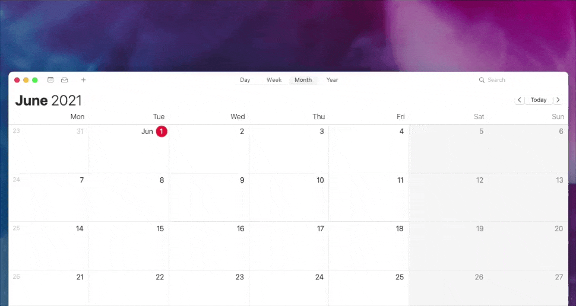

# Calfred 

An Alfred workflow to create calendar events using natural language.

## Set up

1. Download and install the workflow.
2. Install the workflow.
3. Open the workflow in the Alfred Preferences and set the name of the target calendar in the workflow's variables panel ([→ see how](https://github.com/ruggi/calfred/blob/main/images/prefs.gif)).

## Usage

You can create calendar events by typing `cal` in the Alfred input box followed by the event details. Details can be expressed using natural language, for example `standup meeting tomorrow at 10am for 3 hours`. After hitting `Enter`, the event will be created in the calendar as configured in the previous step.

### Examples

- "buy groceries tomorrow at 17"
- "tomorrow buy groceries at 5 pm"
- "sync meeting on Aug 17 at 4pm for 2 hours"
- "run for 2 hours next wednesday at 5pm"
- "all hands next wednesday at 5pm PDT"

## Updating

The workflow will automatically look for updates in the background and prompt to download a new version as soon as it's available.

## Credits

Huge credits to [deanishe's awgo](https://github.com/deanishe/awgo/) package for the Go API and the auto-update utility. Super nice 👌
